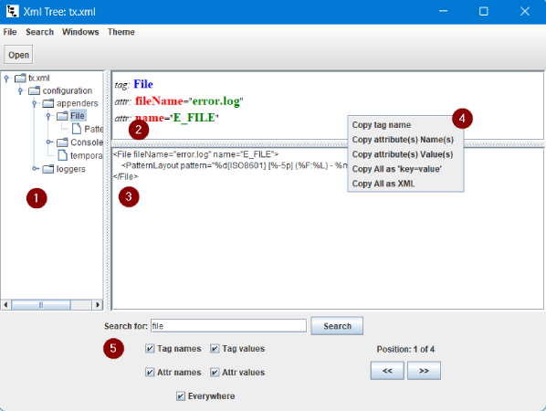

## Xml Tree
### _XML files structure viewer_

[](https://www.java.com/) [](https://uk.wikipedia.org/wiki/Swing_(Java)) [](https://maven.apache.org/)

### 💡 Purpose
Make lightweight multiplatform GUI application with native Java only for convenient viewing of the structure of XML files.

### 📃 Features
- shows XML file structure as tree
- auto file formatting (AKA Fine Print)
- useful Tags and Attributes showing
- possibility of multiple Tag's and Attribute's Names and Values copying
- multiple independent windows interface
- lightweight (less than 51Kb jar file, 21Kb of that - images)
- multiplatform
- quick start and easy to use
- support standard Swing themes (AKA Look and Feel)

### ⏬ Getting
Download zip file from [Releases](https://github.com/anrydas/xmltree/releases) section of this repository, unzip and [launch it](#Launch).
on Linux `launch.sh` or on Windows `launch.cmd`
Or clone the repository and use Maven to build the Application
```shell
git clone XXX
mvn clean package
```

### 🚀 Launch<a id='Launch'/>
Just launch jar file with JRE
- Linux `java -jar xmltree.jar`
- Windows `javaw -jar xmltree.jar`
The standard Open File Dialog appears in currently launch application directory.
Also, you can launch the application with file name as 1st parameter to show XML structure immediately:
```shell
java -jar xmltree.jar <relative_or_full_file_path>
```
If file in parameter have wrong format, or it doesn't exist the Open File Dialog appears to select other one. No any error messages will be shown.

### 📜 Main Window<a id='MainWin'/>

1. XML file tree view with currently selected Tag
2. the Tag and Attribute(s) view with its values with color highlighting
3. formatted XML view
4. Tag and Attribute(s) view's popup Menu:
   - **Copy tag name** - copying Name of the Tag (blue) into system clipboard
   - **Copy attribute(s) Name(s)** - copying **All** Attribute's names of the current Tag (red) into system clipboard
   - **Copy attribute(s) Value(s)** - copying **All** Attribute's values of the current Tag (green) into system clipboard
   - **Copy All as 'key=value'** - copying **All** Tag and Attribute's names and values of the current Tag (green) as **key=value** into system clipboard
   - **Copy All as XML** - copying formatted XML view's content into system clipboard

### 📄 Application Menu<a id='AppMenu'/>
1. **File**
    - **Open** - opens new XML file in new window
    - **Exit** - clos All opened windows and exit application
2. **Theme** - select Theme (Look and Fill) for All opened windows
3. **Windows**
    - **Close this** - close active window
    - **Close all** - clos All opened windows and exit application (the same of `File -> Exit`)
    - **Xml Tree: <file_name>** - switch (make active) to other opened window with **file_name** in 

### 🐞 Known issues
- If you are using Windows with display's Scale greater than 100% it will be useful to launch the application with JRE8 because it makes interface more pretty with smaller controls than JREs greater than 8.

###### _Made by -=:dAs:=-_
